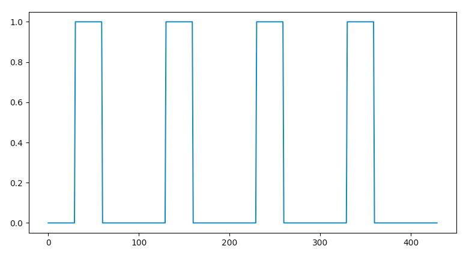
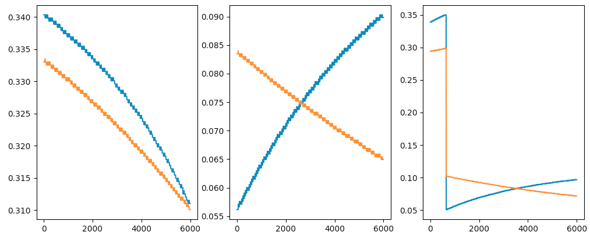

# I see what you did there

The [I see what you did there](https://quals.2020.hackasat.com/scoreboard/challenge/19) challenge grabbed our attention as it appeared to combine side channel analysis with the satellite tracking we did on the earlier [Track the Sat](https://quals.2020.hackasat.com/scoreboard/challenge/16) challenge. So lets get onto the challenge, starting with the challenge description:

> Your rival seems has been tracking satellites with a hobbiest antenna, and it's causing a lot of noise on my ground lines. Help me figure out what he's tracking so I can see what she's tracking.

The downloaded challenge files includes a README.txt file that provides additional context:

```
Track-a-Sat RF Side Channel Detector
====================================

We lost our direct access to control the Track-a-Sat groundstation antenna (see earlier challenge), but we have a new source of information on the groundstation. From outside the compound, we have gathered 3 signal recordings of radio emissions from the cables controlling the antenna motors. We believe the azimuth and elevation motors of each antenna are controlled the same way as the earlier groundstation we compromised, using a PWM signal that varies between 5% and 35% duty cycle to move one axis from 0 degrees to 180 degrees. We need to use these 3 recordings to determine where each antenna was pointing, and what satellite it was tracking during the recording period.

To help you in your calculations, we have provided some example RF captures from a different groundstation with a similar antenna system, where we know what satellites were being tracked. You will want to use that known reference to tune your analysis before moving on to the unknown signals. The example files are in a packed binary format. We have provided a script you can use to translate it to a (large) CSV if you like. The observations are sampled at a rate of 102400Hz and there are two channels per sample (one for azimuth, the other for elevation).
```

So we are given a signal recording that sampled radio emissions from the antenna motor control cables and they are using a [PWM](https://en.wikipedia.org/wiki/Pulse-width_modulation) signal over the cables to control the position of the antenna. This challenge is the inverse of the [Track the Sat](https://quals.2020.hackasat.com/scoreboard/challenge/16) challenge! Instead of outputting a PWM signal based on a ground location, satellite name, and time, we are given a PWM signal (or more accurately a recording of the radio emissions of a PWM signal), ground location, and time and have to output the satellite name.

## Initial Approach

After reading the challenge description and README.txt we came up with the following potential solution:

1. Process the signal recording and recover the PWM signal (or some value that could be mapped to a PWM signal).
2. Select a set of time offsets into the signal and for each:
   1. Recover the PWM signal at that time offset
   2. For each known satellite:
      1. Calculate the azimuth and elevation angles from the ground station to the satellite for this specific time
      2. Compute the PWM signal required to aim the antenna
      3. Compare the computed PWM from the PWM recovered from the signal data, if within an error range, flag the satellite
   3. Record which satellites were flagged
3. Review the flagged satellites for each time offset and the satellite that was in every offset is the satellite being tracked
   1. If there is more than one satellite in every offset decrease the error range and/or increase the number off offsets

In short, we are going to emulate the antenna moving across the sky and see what satellites it pointed at. Since there could be multiple satellites at different altitudes overhead at the same time we are going to do this calculation several times at different time offsets. It is unlikely that more than one satellite be in the same orbit, at the same speed. So the satellite that shows up every time, is the one being tracked!

## Recovering the PWM

From the previous challenge we have code to calculate the PWM to track a satellite so the unknown in this challenge is recovering the PWM from the signal recordings. The challenge files included an example python script to convert the signal to a CVS file and from that script we can see that the signal is encoded as a stream of 32-bit floating point values containing two channels representing the captured radio emission of the azimuth and elevation cables. 

First we plotted the data using the [matplotlib](https://matplotlib.org) package for Python. Extracting one channel and graphing one second of data we saw the following signal:


That looks like a very nice periodic signal! Lets zoom in:


We got some very nice regular cycles with two notable spikes A & B. Just visually we can see the spikes appear to follow the transition of the off to on, and on to off transitions of a PWM signal. For reference, PWM or [Pulse Width Modulation](https://en.wikipedia.org/wiki/Pulse-width_modulation) is a method of reducing the average power of a signal by breaking a signal up into discrete parts and transmitting a series of on and off pulses. The signal is then averaged over a time period and the longer the on pulses are, the higher the average voltage is. An example PWM signal with a 30% "duty cycle" (on 30% of the time) creates the following waveform:



Looking at the captured radio emissions the spikes correspond with the transitions between being on or off. By counting the samples between the spikes and dividing by the number of samples in a complete cycle we can recover the duty cycle. We created a simple (and very inefficient) python script to count cycles and recover the PWM values for both the azimuth and elevation channels.

```python
def calc_pwm_for_cycle(samples, cycle):
    def count_peak_cycles(data, index):
        # find the first peak
        count = 0
        while data[count][index] < THRESHOLD:
            count += 1

        # save this point
        start = count
        
        # advance until this peak goes down
        while data[count][index] > THRESHOLD:
            count += 1

        # find the next peak
        while data[count][index] < THRESHOLD:
            count += 1
        
        # this should be the count of the number of cyles the PWM signal was "on"
        return count - start
    
    # clocks drift/not exactly aligned so we start counting a bit before where we expect the start of the PWM cycle
    i = cycle * SAMPLES_PER_CYCLE
    start = i if i == 0 else i - 100
    tmp_samples = samples[start:i+SAMPLES_PER_CYCLE]

    azimuth_on_cycles = count_peak_cycles(tmp_samples, 0)
    elevation_on_cycles = count_peak_cycles(tmp_samples, 1)

    return (azimuth_on_cycles/SAMPLES_PER_CYCLE, elevation_on_cycles/SAMPLES_PER_CYCLE)
```

To make sure our script  generated reasonable answers for the PWD duty cycle, we graphed these results for all three sample files:



Nice! We got PWM values that are reasonable. According to the readme the PWM has duty cycles between 3% and 35%, all recovered values fall within that range. The azimuth line in the 3rd chart does go from 35% to 3% in one cycle. This looks alarming, but is normal. The PWM signal covers 0° to 180° degrees of movement, to keep moving beyond 180° the signal restarts at 0°.

In this case we were lucky, and it was possible to recover the PWM signal exactly down to the cycle! Most real world side channel attacks require more processing effort. If you would like to generate your own graphs, these are the python scripts we used to generate the graphs:

* [graph_signal.py](https://github.com/ACMEPharm/hack-a-sat-ctf-quals-2020/blob/master/I%20see%20what%20you%20did%20there/graph_signal.py) - Graphs a channel for a specific time slice
* [graph_pwm.py](https://github.com/ACMEPharm/hack-a-sat-ctf-quals-2020/blob/master/I%20see%20what%20you%20did%20there/graph_pwm.py) - Graphs the recovered PWM signal

## Finding the Satellite 

With the PWM signal recovered, we advanced to the next phase to identify the satellites the antenna is pointing at given a PWM signal. Let's walk through calculating the azimuth and elevation angles from a ground location to a satellite at a given time. To calculate these angles, we used the [Skyfield](https://rhodesmill.org/skyfield/) python package.

First, we have to import the database of satellites (the active.txt file from the previous [Track the Sat](https://quals.2020.hackasat.com/scoreboard/challenge/16) challenge) and a time correcting database:

```python
import skyfield.api as sf

SATELLITES = sf.load.tle_file(args.db)
ts = sf.load.timescale()
```

Then we created a global for our ground location:

```python
GROUND_CONTROL = sf.Topos(latitude_degrees=args.latitude, longitude_degrees=args.longitude)
```

To calculate the angles from the ground to the satellite, we created a function that creates a vector from the ground location to a satellite, calculates the topocentric position, then converts to degrees. The [Skyfield](https://rhodesmill.org/skyfield/) python package makes this math easy!

```python
def sat_cal_az_el(sat, t):
    # create a vector between sat and ground control
    diff = sat - GROUND_CONTROL

    # convert time to a SF time object
    t = ts.utc(datetime.datetime.fromtimestamp(t, datetime.timezone.utc))

    # calculate our position
    topocentric = diff.at(t)

    # convert to degrees
    el, az, distance = topocentric.altaz()

    return az.degrees, el.degrees
```

The last part is just converting the degrees to the PWM duty cycle, represented as a percent:

```python
def to_pwm(deg):
    return PWM_MIN + (PWM_MAX - PWM_MIN) * (deg / 180.0)

def sat_calc_pwm(sat, t):
    az, el = sat_cal_az_el(sat, t)

    # If az is over 180°, adjust to reposition at 0°
    if az > 180:
        az = az - 180
        el = 180 - el
    
    return to_pwm(az), to_pwm(el)
```

The rest of the script just selects some random time offsets into the captured signal file, filters the list of SATELLITES to include only those with a calculated PWM value that is within an error range of the recovered PWM. The script keeps track of the satellites we have seen using a python [Counter](https://docs.python.org/3.8/library/collections.html#collections.Counter) collection, at the end the satellite we saw most wins:

```python
def should_filter_sat(sat, azimuth_pwm, elevation_pwm, t, error):
    az, el = sat_calc_pwm(sat, t)

    return abs(az - azimuth_pwm) < error and \
        abs(el - elevation_pwm) < error

seen_stats = collections.Counter()
for i in range(args.num_checks):
    cycle = random.randint(0, NUM_CYCLES - 1)
    t = args.time + cycle * TIME_PER_CYCLE
    azimuth_pwm_signal, elevation_pwm_signal = calc_pwm_for_cycle(samples, cycle)
    print("Signal Cycle:", cycle, "Time:", t)
    print("\tAzimuth:", azimuth_pwm_signal)
    print("\tElevation:", elevation_pwm_signal)

    sats = filter(lambda sat: should_filter_sat(sat, azimuth_pwm_signal, elevation_pwm_signal, t, args.error), SATELLITES)
    seen_stats.update(map(lambda sat: sat.name, sats))
    print("\tCurrent Stats:", ", ".join(map(lambda x: f"{x[0]} ({x[1]})", seen_stats.most_common())))

print()
print("Final stats")
print("="*20)
for name, count in seen_stats.most_common():
    print(f"{name} ({count})")
```

When running the script against the example signal data, it finds the targeted satellite! The CANX-7 satellite appeared in every time offset, and indeed the provided example data was for an antenna tracking the CANX-7 satellite.

```
~/D/C/H/I see what you did there> ./sat_finder.py active.txt examples/signal_0.bin 32.4907 45.8304 1586249863.726371 --error .02 --num_checks 5
Signal Cycle: 5440 Time: 1586249972.526371
	Azimuth: 0.31494140625
	Elevation: 0.3125
	Current Stats: CANX-7 (1), COSMOS 2531 (1), HONGYAN 1 (CHONGQING) (1), AQT-D (1)
Signal Cycle: 5388 Time: 1586249971.486371
	Azimuth: 0.3154296875
	Elevation: 0.31298828125
	Current Stats: CANX-7 (2), COSMOS 2531 (2), HONGYAN 1 (CHONGQING) (2), AQT-D (2)
Signal Cycle: 3828 Time: 1586249940.286371
	Azimuth: 0.3251953125
	Elevation: 0.31982421875
	Current Stats: CANX-7 (3), HONGYAN 1 (CHONGQING) (3), COSMOS 2531 (2), AQT-D (2), UNITE (1), STARLINK-1126 (1)
Signal Cycle: 1079 Time: 1586249885.306371
	Azimuth: 0.3369140625
	Elevation: 0.330078125
	Current Stats: CANX-7 (4), HONGYAN 1 (CHONGQING) (3), COSMOS 2531 (2), AQT-D (2), UNITE (1), STARLINK-1126 (1), MERIDIAN 7 (1), ASNARO (1)
Signal Cycle: 859 Time: 1586249880.906371
	Azimuth: 0.33740234375
	Elevation: 0.33056640625
	Current Stats: CANX-7 (5), HONGYAN 1 (CHONGQING) (3), COSMOS 2531 (2), AQT-D (2), MERIDIAN 7 (2), ASNARO (2), UNITE (1), STARLINK-1126 (1)

Final stats
====================
CANX-7 (5)
HONGYAN 1 (CHONGQING) (3)
COSMOS 2531 (2)
AQT-D (2)
MERIDIAN 7 (2)
ASNARO (2)
UNITE (1)
STARLINK-1126 (1)
```

Success on the first shot! The script was able to match all the examples and the unknown samples on the live challenge. We had a lot of fun on this challenge, being able to do side channel analysis to recover the PWM signal and combining it with the cool [Skyfield](https://rhodesmill.org/skyfield/) package to perform orbit calculations.

### Code

Here is the source of the scripts we used to solve this challenge:

* [sat_finder.py](https://github.com/ACMEPharm/hack-a-sat-ctf-quals-2020/blob/master/I%20see%20what%20you%20did%20there/sat_finder.py) - Finds a satellite pointed to by an antenna using a side channel recording of the antennal's PWM aiming cables.
* [graph_signal.py](https://github.com/ACMEPharm/hack-a-sat-ctf-quals-2020/blob/master/I%20see%20what%20you%20did%20there/graph_signal.py) - Graphs a channel for a specific time slice
* [graph_pwm.py](https://github.com/ACMEPharm/hack-a-sat-ctf-quals-2020/blob/master/I%20see%20what%20you%20did%20there/graph_pwm.py) - Graphs the recovered PWM signal

